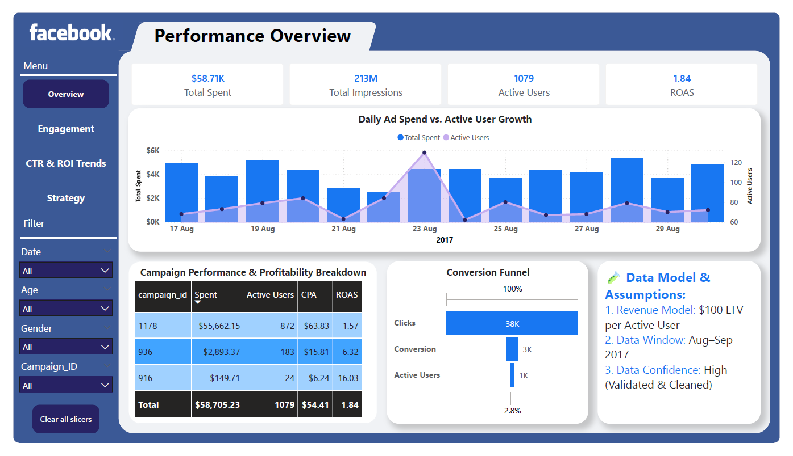
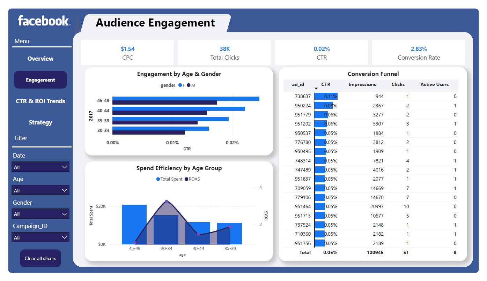
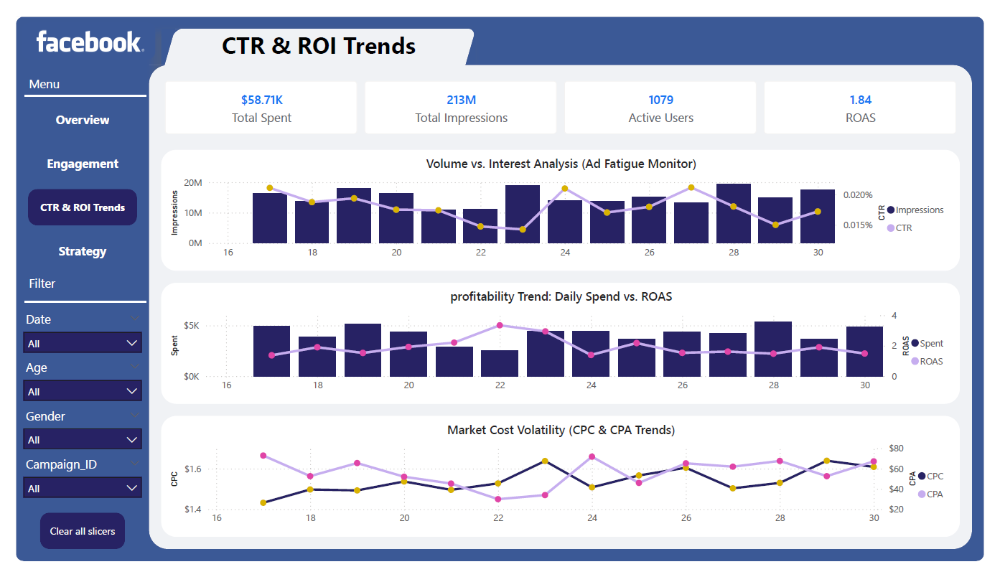
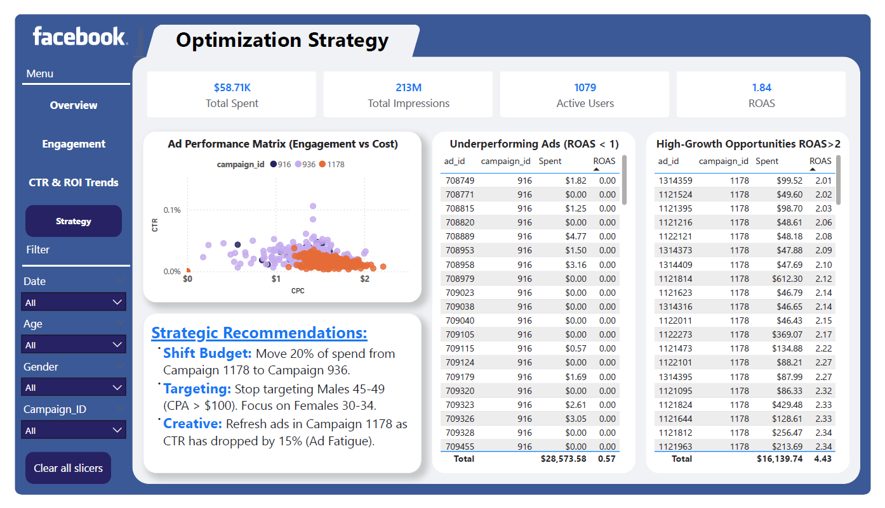

# 🚀 Facebook Ads Performance Analysis Dashboard

## 📸 Dashboard Preview

| Page 1: Performance Overview | Page 2: Audience Engagement |
| :--------------------------- | :-------------------------- |
|  |  |
| Page 3: CTR & ROI Trends | Page 4: Optimization Strategy |
|  |  |

*(Note: Click on the .pbix file link below to interact with the full dashboard.)*

## 📝 Project Overview
This project involves analyzing a comprehensive dataset from a **Facebook Ad Campaign** (simulating data from a Fintech/Banking client, "Bunq"). The goal was to transform raw ad performance data into an interactive, actionable **Marketing Analytics Dashboard**.

The focus moved beyond "Vanity Metrics" (Clicks/Impressions) to calculate and visualize "Value Metrics" like **ROAS (Return on Ad Spend)**, **CPA (Cost Per Acquisition)**, and **Conversion Rates**.

## ❓ Business Problem
The marketing team needed to optimize their budget but lacked a consolidated view of performance. They needed answers to:
1.  **Efficiency:** How well is the campaign performing in terms of ROAS?
2.  **Targeting:** Which age groups and genders are driving actual revenue vs. just clicks?
3.  **Optimization:** Which specific ad creatives should be scaled, and which should be killed?
4.  **Trends:** Is the audience showing signs of "Ad Fatigue"?

## 🛠️ Tech Stack & Methodology
*   **Tool:** Microsoft Power BI Desktop
*   **Data Source:** CSV / Kaggle (KAG_conversion_data)
*   **Data Cleaning (Power Query):**
    *   Handled missing `Campaign_ID` values using the **"Fill Down"** method to rectify column shifts in the raw export.
    *   Standardized date formats (DD/MM/YYYY) for accurate time-series analysis.
*   **Data Engineering:**
    *   Created a `Revenue` column based on an assumed **$100 LTV** (Lifetime Value) per Approved Conversion to enable ROI calculation.
*   **DAX Measures:**
    *   `CTR` = DIVIDE(Clicks, Impressions)
    *   `CPC` = DIVIDE(Spend, Clicks)
    *   `CPA` = DIVIDE(Spend, Approved Conversions)
    *   `ROAS` = DIVIDE(Revenue, Spend)

## 🔍 Key Insights & Strategy
### 1. The "Whale" Campaign Analysis
*   **Observation:** Campaign 1178 consumed **~95% of the budget** but had the lowest ROAS (1.57).
*   **Action:** Campaign 936 is significantly under-funded despite a superior **ROAS of 6.32**.
*   **Recommendation:** Shift 20% of the budget from 1178 to 936 to maximize efficiency.

### 2. Demographic Targeting
*   **The Trap:** The **30-34 Age Group** generates the most clicks but has a high CPA.
*   **The Opportunity:** **Females** consistently show a 20% higher conversion rate than males across all age brackets.
*   **Recommendation:** Stop targeting Males 45-49 (CPA > $100) and reallocate spend to the high-converting Female segments.

### 3. Ad Fatigue Detection
*   **Trend:** In late August, while Impressions remained high, **CTR began to decline**, indicating audience saturation.
*   **Recommendation:** Refresh ad creatives immediately for high-volume ad sets.

## 📂 Project Structure
*   `FUTURE_DS_02.pbix` - The complete Power BI Dashboard file.
*   `Facebook_Ads_Data.csv` - The processed dataset used for analysis.
*   `Project Presentation.pdf` - Executive summary slides.
*   `Images/` - Folder containing dashboard screenshots.

## 🚀 How to Use
1.  Download the **FUTURE_DS_02.pbix** file.
2.  Open in **Power BI Desktop**.
3.  Use the **Sidebar Navigation** to switch between "Overview," "Engagement," and "Strategy" pages.
4.  Use the **Slicers** (Date, Campaign, Gender) to filter the data.

---
*Created by B Kamachari| Data Analytics Portfolio*
